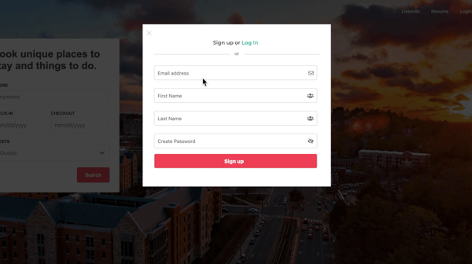

# AirZzz

AirZzz is a full-stack single-page web application modeled after the notorious Airbnb. It uses Ruby on Rails as the webframework to handle all API requests, React/Redux to manage frontend state changes, and a PostgreSQL database on the backend. To manage all of the displayed photos, the application links Amazon Web Services. 


**[Visit the Live Application](https://air-zzz.herokuapp.com/#/)**

# Technologies 
* React/Redux
* Ruby on Rails
* PostgreSQL
* Javascript
* CSS
* HTML
* AWS
* Google Maps API
* Webpack 
* jQuery 

# Key Features 

## User Authenticaton
* Users can create an account
* Users can log in

* Users cannot make rentals without being logged in
```
class User < ApplicationRecord 
    validates :email, :fname, :lname, :password_digest, :session_token, presence: true 
    validates :password, length: {minimum: 8}, allow_nil: true 
    validates :email, uniqueness: true
    attr_reader :password 
    after_initialize :ensure_session_token 

    def self.find_by_credentials(email, password) 
        user = User.find_by(email: email)
        return nil unless user && user.valid_password?(password)
        user
    end

    def password=(password) 
        @password = password 
        self.password_digest = BCrypt::Password.create(password)
    end

    def valid_password?(password)
        BCrypt::Password.new(self.password_digest).is_password?(password)
    end 

    def self.generate_session_token 
        SecureRandom.urlsafe_base64
    end

    def reset_session_token 
        self.session_token = User.generate_session_token 
        save! 
        self.session_token
    end

    def ensure_session_token
        self.session_token ||= User.generate_session_token
    end

end
```

## Listings Search + Google Maps API
* Users can view featured listings shown on the map using Google Maps API
* Users can search in a search bar for listings in their area
* Users can move the map and the search results will adjust to display only what is in the map bounds

* User can click on a listing which brings them to a show page
```
class ListingMap extends React.Component {
    constructor(props) {
        super(props)
        this.registerListeners = this.registerListeners.bind(this);
        this.makeMapWork = this.makeMapWork.bind(this);
    }
    componentDidMount() {
        const mapOptions = {
            center: { lat: 42.335814, lng: -71.168923 }, 
            zoom: 13
        };
        this.map = new google.maps.Map(this.mapNode, mapOptions);
        this.MarkerManager = new MarkerManager(this.map);
        this.registerListeners();
        this.MarkerManager.updateMarkers(this.props.listings);
        google.maps.event.addListener(this.map, 'bounds_changed', () => {
            var input = document.getElementById('airzzz-search');
            this.autocomplete = new google.maps.places.Autocomplete(input);
            this.autocomplete.setBounds(this.map.getBounds());
            this.makeMapWork();
        });
    }


    makeMapWork() {
        
        var markers = [];
        const map = this.map;
        google.maps.event.addListener(this.autocomplete, 'place_changed', () => {
            var place = this.autocomplete.getPlace();
            markers.push(new google.maps.Marker({
                map: map,
                title: place.name,
                position: place.geometry.location
            }));
            var bounds = new google.maps.LatLngBounds();
            if (place.geometry.viewport) {
                    // Only geocodes have viewport.
                    bounds.union(place.geometry.viewport);
                } else {
                    bounds.extend(place.geometry.location);
                }
            map.fitBounds(bounds);
        });
    }

    componentDidUpdate() {
        this.MarkerManager.updateMarkers(this.props.listings);
    }

    registerListeners() {
        google.maps.event.addListener(this.map, 'idle', () => {
            const { north, south, east, west } = this.map.getBounds().toJSON();
            const bounds = {
                northEast: { lat: north, lng: east },
                southWest: { lat: south, lng: west }
            };
            this.props.updateFilter('bounds', bounds);
        });
        google.maps.event.addListener(this.map, 'click', (event) => {
            const coords = getCoordsObj(event.latLng);
            this.handleClick(coords);
        });
    }
```

## Bookings 
* Users can input their potential rental date

* Listings that have not already been rented will show up
```
class Booking extends React.Component {
    ...
    handleSubmit(e) {
        e.preventDefault(); 
        if (!this.props.user) {
            this.props.openModal('signup');
            return;
        }
        const { startDate, endDate, listing_id, guests} = this.state; 
        this.setState({guests: this.state.adults + this.state.children + this.state.infants})
        this.props.processForm({
            start_date: moment(startDate).format("YYYY-MM-DD"),
            end_date: moment(endDate).format("YYYY-MM-DD"),
            listing_id,
            guests
        }).then( () => this.props.history.push("/listings/trips"));
    }

    isDayBlocked(date) {
        const formatted = moment(date).format("YYYY-MM-DD");
        for (let i = 1; i < Object.keys(this.props.bookings).length + 1; i++) {
            if (!Object.values(this.props.bookings)[i]) break; 
            if (formatted >= Object.values(this.props.bookings)[i].start_date && formatted <= Object.values(this.props.bookings)[i].end_date && this.props.listing.id === Object.values(this.props.bookings)[i].listing_id) {
                return true; 
            }
        }

    }
    ...
 ```
* Users can access to all of their past and future trips 

## Reviews
* Users who have completed a trip may write a review

* Users can look at reviews
```
class Api::ReviewsController < ApplicationController 

    def create 
        @review = Review.new(review_params)
        @review.user_id = current_user.id 
        if @review.save 
        else  
            render json: ["Review invalid"], status: 422
        end 
    end 

    private 
    def review_params
        params.require(:review).permit(:listing_id, :body, :accuracy, :communication, :cleanliness, :location, :check_in, :value)
    end
end

```
* Listing total reviews are displayed and auto-adjusted to match rating


